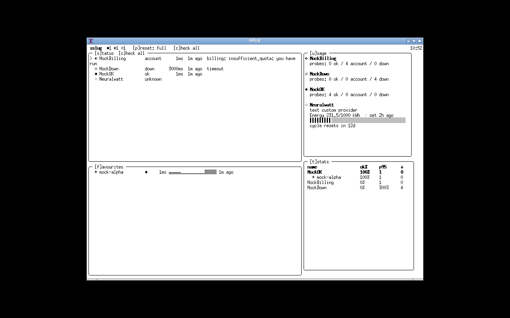

<div align="center">

```
█▀▀ █▀▀ █   █ █ ▄▀▀
▄▄█ ▄▄█ █▄▄ █▄█ █▄█
```

# status-slug

**A btop-style status board for your AI providers — health, usage, and latency at a glance.**

[](https://github.com/chriisbusy/status-slug/actions/workflows/ci.yml)
[](https://pkg.go.dev/github.com/chriisbusy/status-slug)
[](LICENSE)
[](go.mod)

</div>

---

One command answers three questions you actually have about the providers you pay for
and depend on: **is it up**, **how much have I burned**, and **how fast is it right now**.

`sslug` watches any number of LLM providers — the mainstream clouds, the reseller
du jour, the box under your desk running Ollama, or a fully custom HTTP endpoint —
and presents their status, usage meters, and favourite-model latency in a single,
composable terminal dashboard. When you're not looking at the dashboard, the same
data feeds your tmux status line, your scripts, and your other tools over a
versioned JSON seam.

## Screenshot



*Green/yellow/red health with reason text, per-provider usage meters with caps and
reset cycles, favourite-model latency sparklines, and a probe-statistics table.
Shown here against the built-in mock provider (`make mock`).*

## Install

**Go (recommended):**

```sh
go install github.com/chriisbusy/status-slug/cmd/sslug@latest
```

**From source:**

```sh
git clone https://github.com/chriisbusy/status-slug
cd status-slug
make build        # → ./sslug
```

Requirements: Go 1.26+ to build (see `go.mod`); any modern terminal to run. A
[Nerd Font](https://www.nerdfonts.com/) is optional — the default glyph set is
plain Unicode (`●◐○`, blocks, braille) and degrades gracefully (`NO_COLOR`
respected, non-truecolor terminals auto-degrade, narrow terminals reflow to a
stacked layout).

## Quick start

```sh
sslug            # first run: setup wizard (provider → key → models → meters)
sslug            # thereafter: the dashboard
sslug check      # probe everything now
sslug status     # last snapshot, no network
```

The wizard walks you through provider identity, API-key storage (OS keyring,
environment reference, or a plaintext file you explicitly opt into), model
discovery with favourite selection, and optional usage meters — then offers to
add another provider.

## The dashboard

Four panes, all configurable; presets cycle with `p`:

| Pane | What it shows |
|---|---|
| **status** | `●/◐/○` health per provider with reason text, latency, and age |
| **usage** | Meters per provider — any unit, capped or not, with reset cycles and value age |
| **favourites** | Latency cockpit: status dot, last latency, braille sparkline ring |
| **stats** | Checks / ok% / p50 / p95 / down counts per provider and favourite |

Keys: `tab` cycle focus · `j/k` scroll · `c`/`⏎` check now · `i` inspect ·
`s/u/f/t` pane menus · `p` view presets · `e` cycle themes (live) ·
`o` options · `a` add provider (setup wizard popup) · `d` remove provider ·
`z` zoom pane · `?` help · `q` quit.

## Usage meters

Meters track anything with a number and a unit — spend, energy, requests,
credits — per provider:

```toml
[[providers.meters]]
name  = "Energy"
unit  = "kWh"          # any unit string
kind  = "manual"       # or "auto" where an adapter exists
cap   = 1000.0         # omit for uncapped
reset = "monthly:1"    # monthly:<day> | weekly:<mon..sun> | date:<YYYY-MM-DD> | never
```

Update manual meters from scripts or the TUI:

```sh
sslug usage set Neuralwatt Energy 231.5
```

Auto meters fetch themselves where a provider exposes an API — OpenRouter
credits ships in the box (`kind = "auto"`, `auto = "openrouter-credits"`).
Providers without a usage API get manual meters or none — sslug never
fabricates numbers.

## The JSON seam

Everything the dashboard knows is available to other tools, no network required
(reads the last persisted snapshot):

```sh
sslug status --format json     # full snapshot, "schema": 1
sslug status --format tmux     # ●3 ◐1 ○0  — drop into your status line
sslug usage  --format moshi    # moshi-hook-compatible usage snapshots
sslug serve                    # GET 127.0.0.1:19777/status.json + /usage.json
```

tmux status-right, for example:

```
set -g status-right '#(sslug status --format tmux) '
```

The `"schema": 1` field is a versioned contract: breaking shape changes bump it.

## Providers

Presets for OpenAI, OpenRouter, Anthropic, Google Gemini, Groq, DeepSeek,
Mistral, and Ollama (local, no key) — plus **custom**: any base URL with an
OpenAI-compatible `/models` endpoint works. Health classification is honest:
`401/403` and `402/insufficient_quota` are *account* problems (yellow), not
outages; `5xx`, timeouts, and DNS failures are *down* (red); `429` is a rate
limit, not a fire.

## Configuration & data

- Config: `~/.config/status-slug/config.toml` (`SSLUG_CONFIG_HOME` to override)
- State: `~/.local/state/status-slug/state.json` (`SSLUG_STATE_HOME`)
- Keys: OS keyring by default (service `sslug`); `env:VAR` references; or an
  opt-in 0600 file on headless systems. Keys are never printed, logged, or
  written outside the secret store.
- Themes: builtins `sstop` (default, btop-evoking), `mocha`, `nord`, `gruvbox`, `dracula`, `mono`,
  plus your own `~/.config/status-slug/themes/<name>.theme` files — every
  colour role is configurable, invalid roles fall back with a warning, never
  a crash. `theme_background = true` paints the theme background (btop's
  `theme_background`); the default `false` lets your terminal's own
  background through. Light-background terminals automatically get
  terminal-native colors so nothing renders invisible.

## FAQ

**Do probes cost money?**
Provider health probes hit the free `GET /models` endpoint. Favourite-model
probes send a 1-token completion (`max_tokens: 1`, "ping") — about 1–2 tokens
per favourite per check. `check_on_launch` defaults to off.

**I'm headless / over SSH — no keyring?**
The wizard detects that and offers an explicit choice: a 0600-permission file
(with a plaintext-at-rest warning), an environment variable reference, or
abort. `sslug doctor` reports which store is live.

**Does it phone home?**
No telemetry, no analytics, no update checks. The only network calls are to
the provider endpoints you configured. This is a hard invariant, not a
preference.

**What does the traffic light actually mean?**
Green = a real probe succeeded. Yellow = your account needs attention
(auth, billing, or rate limit). Red = the service is unreachable or erroring.
Grey = never checked. Every state carries the reason and the time.

**Can it track my reseller / homelab / bespoke endpoint?**
That's the point of the `custom` kind: give it a base URL and, optionally,
a key. If it speaks `GET /models` and `POST /chat/completions`, it's a
first-class citizen.

**What's moshi format?**
`sslug usage --format moshi` emits usage snapshots in the
[moshi](https://github.com/chriisbusy/moshi)-hook schema (`accountId`,
`accountLabel`, `windows[]`, `cost{}`), ready for iOS sync pipelines.
`sslug serve` exposes the same data over loopback HTTP for always-on
consumers.

## Acknowledgements

The design DNA — dense bordered panes, braille sparklines, gradient chrome,
everything-configurable — is a loving tribute to
[**btop**](https://github.com/aristocratos/btop) by Aristocratos, which proved
system monitors could be beautiful. `sslug` applies the same craft to a
different machine room. Built on the [Charm](https://charm.land) stack
(Bubble Tea v2, Lip Gloss, Bubbles, Huh).

## License

MIT — see [LICENSE](LICENSE).
